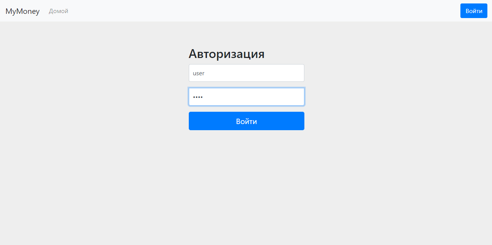
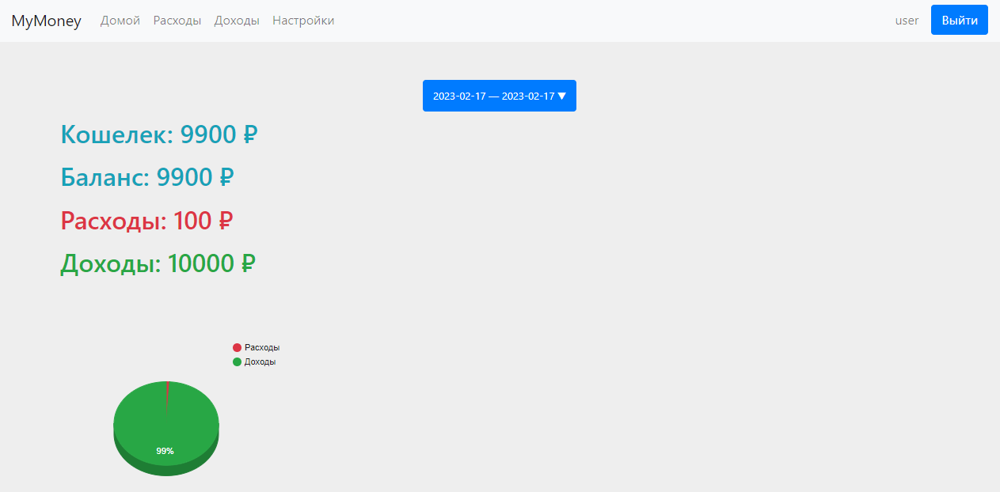
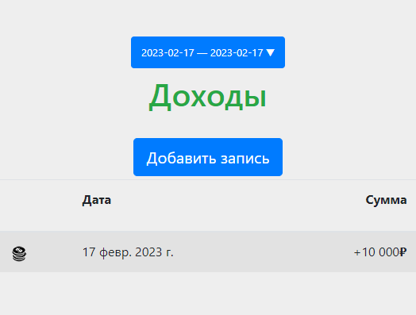
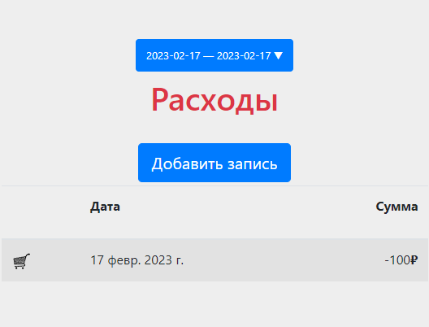
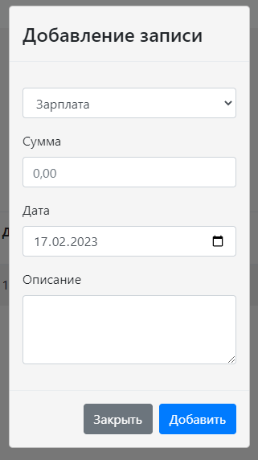
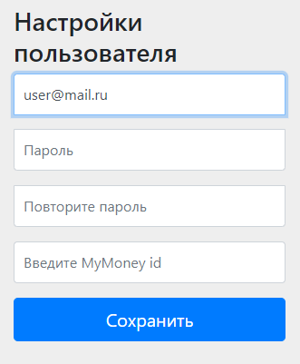
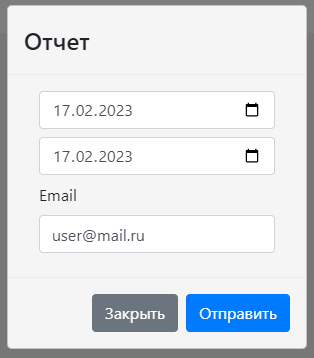

# Moneybox - учет личных финансов
___
Stack: Java, (Spring Boot, MVC, Security), PostgreSQL, Freemarker
## 1. Авторизация:

  

## 2. Домашняя страница:

  

Отображение баланса, суммы расходов и доходов за указанный период

## 3. Страница расходов/доходов:

  
&nbsp; &nbsp; &nbsp; &nbsp;
  

Отображение всех расходов и доходов за указанный период. Возможность добавить новую запись

## 4. Добавление расходов/доходов:

  

Тип расхода/дохода, сумма, дата (по умолчанию текущий день), описание расхода/дохода

## 5. Настройки пользователя:

  

Смена Email, смена пароля, привязка Telegram id для управления расходами через <a href="https://github.com/ikhudyakov/moneyBot>">телеграм бота </a>

## 6. Отправка отчета:

  

Выбор периода отчета, Email для отправки (по умолчанию берется из настроек пользователя)

